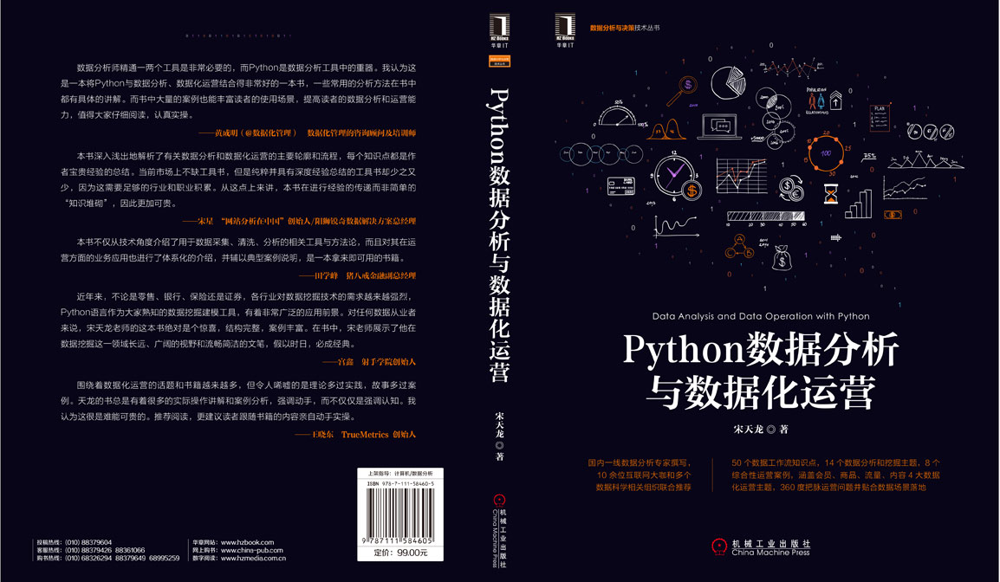

`README.md`

# [书籍] python 数据分析与数据化运营 - 第 1 版

## 📖 前言与简介

### 为什么要写这本书

随着商业环境的日益严峻，企业需要不断寻找提高利润率、降低成本、提高产出价值的有效方法，而数据化运营恰好是满足企业这一需求的关键武器。数据化运营包含了运营和数据两种要素，前者需要较多的业务经验，而后者则对数据分析提出了更高要求。只有把二者结合起来，在有足够技能、经验和技术的支持下，数据化运营才能在企业内部真正落地、生根、发芽。

对数据化运营而言，各企业普遍关注的结构化数据分析、挖掘的场景非常丰富，例如销售预测、会员生命周期维护、商品结构分析等，这些普遍的共同认知为本书提供了接地气的基础；但除了这些“传统内容”外，还有很多非结构化的数据主题，它们在数据化运营过程中的角色越来越重要，例如主题挖掘、图片分析、文本挖掘、图像识别、语音识别等，这些内容拓展了数据化运营发挥价值的场景基础。

Python 作为数据工作领域的关键武器之一，具有开源、多场景应用、快速上手、完善的生态和服务体系等特征，使其在数据分析与数据化运营中的任何场景都能游刃有余；即使是在为数不多的短板上，Python 仍然可以基于其“胶水”的特征，引入对应的第三方工具/库/程序等来实现全场景、全应用的覆盖。在海量数据背景下，Python 对超大数据规模的支持性能、数据分析处理能力和建模的专业程度以及开发便捷性的综合能力要远远高于其他工具。因此，Python 几乎是数据化运营工作的不二之选。

纵观整个国内市场，有关 Python 的书籍不少，但普遍的思路都是基于工具层面的介绍，而且侧重于工具本身的方法、参数、调用、实例，与真正实践的结合较少；有关数据化运营的书籍，目前市场上还为数不多，现有的数据化运营也大多是基于 Excel 等工具的入门级别的分析。本书结合了 Python 和数据化运营两个方面，在结合了数据分析工作流程和数据化运营主题的基础上，通过指标、模型、方法、案例配合工具的形式，详细介绍了如何使用 Python 来支持数据化运营，尤其是传统工具无法满足的应用场景。

我希望能尽自己的微薄之力，将过往所学、所感、所知提炼出来供更多人了解。如果读者能感悟一二，我将倍感欣慰；如果读者能将其用于工作实践，这将是本书以及数据工作之福！

### 读者对象

本书定位于提供有关数据与运营的结合知识的介绍和应用，虽然基础工具是 Python，但本书并没有就 Python 基础规则和语法做详细介绍，因此希望读者具有一定的 Python 基础。相信我，只要你认真看 Python 教学视频（网络上很多），只需大概 2 个小时就能具备这种基础。

本书对读者的知识背景没有特定要求，书中的内容都尽量言简意赅、深入浅出。本书适合以下几类读者阅读：

- **企业运营人员**：本书的核心命题就是运营，其中涉及到会员运营、商品运营、流量运营和内容运营四大主题，无论运营人员希望获得运营知识还是数据分析和挖掘方法，都可以从书中获益。
- **数据分析师**：毫无疑问，数据分析师是本书的核心受众群体之一，本书中介绍的数据抽取、预处理和分析挖掘经验一定能带来很多之前“不一样”的收获，每个运营主题下的小技巧、模型和案例更能激发数据灵感——原来数据工作还能这样做。
- **Python 工程师**：坦白讲，本书不是一本专门介绍 Python 语法、规则的书籍。但 Python 作为一种“万能”工具，在数据分析和挖掘领域具有举足轻重的地位，任何一个 Python 工程师如果知识领域中包含数据（或大数据），那么其价值会成倍增长。本书中 Python 数据处理、计算和挖掘库的应用介绍以及有关工具库的介绍、用法、注意点和小知识一定会对 Python 工程师的工作领域和认知产生新的启迪。
- **数据挖掘工程师**：数据分析与挖掘在实际运营中都是不分家的，本书没有冠以“挖掘”之名但并不意味着没有挖掘（或机器学习）算法，本书第 4 章基本都是围绕常用算法展开的知识介绍，其中各个算法类的“大坑”都是笔者多年经验的总结；在运营主题中提到的基于超参数优化的 `Gradient Boosting` 的预测，基于 `LogisticRegression`、`RandomForest`、`Bagging` 概率投票组合模型的异常检测，基于自动 K 值的 `KMeans` 聚类分析，基于潜在狄利克雷分配（LDA）的内容主题挖掘，基于多项式贝叶斯的增量学习的文本分类等都是与“挖掘算法”相关的应用。算法是数据工作的核心组成，其介绍必不可少。

### 如何阅读本书

本书内容从逻辑上共分为两大部分，第一部分是有关数据分析类的主题，第二部分是有关数据化运营的主题。

第一部分的内容包括 1/2/3/4 章和附录，主要介绍了 Python 和数据化运营的基本知识、数据来源获取、数据预处理以及数据分析和挖掘的关键经验。其中：

- 第 2 章的数据源包含了传统的结构化和非结构化数据来源及获取，包括数据文件、数据库、API、流式数据、外部公开数据等，也提到了如何读取网页、文本、图片、视频、语音等类型的数据。
- 第 3 章的数据预处理总结了常用的 11 条结构化数据的预处理经验，并介绍了有关网页数据解析、日志解析、图像预处理和自然语言预处理的内容。
- 第 4 章的数据分析和挖掘经验总结了 8 个数据分析、挖掘和网站分析方法的主题类，各个类别中都以关键经验为基础展开详细介绍。

第二部分的内容包括 5/6/7/8/9 章的内容，分别介绍了会员运营、商品运营、流量运营和内容运营四个大主题以及提升数据化运营价值度的方法。在每个数据化运营主题中都包含了基本知识、评估指标、应用场景、数据分析模型、数据分析小技巧、数据分析大实话以及 2 个应用案例。

- **基本知识**：有关运营主题的基本内涵、价值、用途等方面的介绍。
- **评估指标**：运营主题的评估指标，按类别拆分和归纳。
- **应用场景**：数据对于运营的价值落地在哪些场景中的总结。
- **数据分析模型**：“大型”的数据分析方法，包括统计分析、数据挖掘、网站分析甚至数学模型。
- **数据分析小技巧**：“小型”的数据分析的方法，看起来相对简单但非常有效。
- **数据分析大实话**：有关运营或数据分析的潜在规律的解释及介绍。
- **应用案例**：每个运营主题都包含 2 个应用案例，基本上每个案例的应用算法和技巧都不相同，目的是呈现不同算法在不同场景下的差异化应用。

除了以上内容外，以下信息是在本书中涉及特定内容的解释和说明：

- **内容延伸**：本书第 1/2/3/4 章都有内容延伸章节，其内容是有关非结构化主题的读取、分析、处理，由于每个主题如果展开来写都能写一本书，因此仅在内容延伸中抛砖引玉，有兴趣的读者可以加以了解和学习。
- **相关知识点**：本书很多章节中都有“相关知识点”内容介绍，其内容是关于特定工具、知识、算法、库等方面的较为详细的介绍，他们充当了本书的知识堡垒。
- **本章小结**：每章的结尾都有“本章小结”，在小结中包含 4 部分内容：
  - **内容小结**：内容小结是有关本章内容的总结
  - **重点知识**：重点知识是本章重点需要读者掌握的知识和内容
  - **外部参考**：外部参考是本章提到的对应内容但是无法详细介绍的内容，都在外部参考中列出，有兴趣的读者可以基于外部参考构建自己的知识图谱。
  - **应用实践**：基于本章内容推荐读者在实践中落地的建议。
- **提示**：对于知识点的重要提示和应用技巧，相对“相关知识点”而言，每条提示信息内容量较少，一般都是经验类的总结。
- **注意**：特定知识需要引起注意的方面，这些注意点是应用过程中需要避免的“大坑”。
- **特定名词的混用**：本书中提到了库、包等多种代词，但本质上笔者没有做严格区分，因此二者在很多时候都是等价的。
- **关于附件的使用方法**：除了第 9 章外，本书的每一章都有对应源数据和完整代码，该内容可在本书附件中找到，附件可以在华章网站 `http://www.hzbook.com` 或者笔者网站 `http://www.dataivy.cn` 下载。需要注意的是，为了更好的让读者了解每行代码的含义，笔者在注释信息中都使用了中文标注，每个程序文件的编码格式都是 `UTF-8`。

### 勘误和支持

由于本书的作者水平有限并受限于有限的撰稿时间，书中难免会出现一些错误或者不准确的地方，恳请读者批评指正。读者可通过以下途径联系并反馈建议或意见：

- **即时通讯**：添加个人 QQ（517699029）或微信（TonySong2013）反馈问题
  直接扫描二维码添加个人微信
- **网站讨论区**：在笔者网站 `http://www.dataivy.cn` 的书籍讨论区留言
- **电子邮件**：发送 email 到 `beijingtl@gmail.com`

### 致谢

在本书的撰写过程中，得到了来自多方的指导、帮助和支持。

首先要感谢的是机械工业出版社华章公司的总编辑杨福川老师，杨老师在我出版了两本书之后鼓励我继续撰写此书，并为此书的撰写提供了方向和思路指导。

其次要感谢在各个数据项目和工作中提供宝贵经验和支持的良师益友和工作伙伴们，他们是（排名不分先后）：田学峰、庞程程、许子东、赵光娟、吕兆星、郑传峰、杨晓鹏、陈骏、江涛、曹佳佳等。

再次要感谢全程参与审核、校验等工作的孙海亮老师以及其他背后默默支持的出版工作者，是他们的辛勤付出才保证本书的顺利面世。

最后感谢我的父母、家人和朋友，尤其是我的夫人姜丽女士，是她在我写书的这段期间里把家里的一切料理的井井有条，使得我有精力完成此书的全部撰写工作。

谨以此书献给热爱数据工作并为之奋斗的朋友们，愿大家身体健康、生活美满、事业有成！

宋天龙（Tony Song）

2017 年 7 月于中国北京

## 📑 目录

- 第 1 章 Python 和数据化运营
  - 1.1 用 Python 做数据化运营
    - 1.1.1 Python 是什么
    - 1.1.2 数据化运营是什么
    - 1.1.3 Python 用于数据化运营
  - 1.2 数据化运营所需的 Python 相关工具和组件
    - 1.2.1 Python 程序
    - 1.2.2 Python IDE
    - 1.2.3 Python 第三方库
    - 1.2.4 数据库和客户端
    - 1.2.5 SSH 远程客户端
  - 1.3 .内容延伸：Python 的 OCR 和 Tenserflow
  - 1.4 第一个用 Python 实现的数据化运营分析实例-销售预测
  - 1.5 本章小结
- 第 2 章 数据化运营的数据来源
  - 2.1 数据化运营的数据来源类型
    - 2.1.1 数据文件
    - 2.1.2 数据库
    - 2.1.3 API
    - 2.1.4 流式数据
    - 2.1.5 外部公开数据
    - 2.1.6 其他
  - 2.2 使用 Python 获取运营数据
    - 2.2.1 从文本文件读取运营数据
    - 2.2.2 从 Excel 获取运营数据
    - 2.2.3 从关系型数据库 MySQL 读取运营数据
    - 2.2.4 从非关系型数据库 MongoDB 读取运营数据
    - 2.2.5 从 API 获取运营数据
  - 2.3 内容延展：读取非结构化网页、文本、图像、视频、语音
    - 2.3.1 从网页中爬取运营数据
    - 2.3.2 读取非结构化文本数据
    - 2.3.3 读取图像数据
    - 2.3.4 读取视频数据
    - 2.3.5 读取语音数据
  - 2.4 本章小结
- 第 3 章 11 条数据化运营不得不知道的数据预处理经验
  - 3.1 数据清洗：缺失值、异常值和重复值的处理
    - 3.1.1 遇到缺失值就要补全吗
    - 3.1.2 不要轻易抛弃异常数据
    - 3.1.3 数据重复就需要去重吗
    - 3.1.4 代码实操：Python 数据清洗
  - 3.2 将分类数据和顺序数据转换为标志变量
    - 3.2.1 分类数据和顺序数据是什么
    - 3.2.2 运用标志方法处理分类和顺序变量
    - 3.2.3 代码实操：Python 标志转换
  - 3.3 大数据时代，数据化运营还需要降维吗
    - 3.3.1 什么情况下需要降维
    - 3.3.2 基于特征选择的降维
    - 3.3.3 基于维度转换的降维
    - 3.3.4 代码实操：Python 数据降维
  - 3.4 解决样本类别分布不均衡的问题
    - 3.4.1 哪些运营场景中容易出现样本不均衡
    - 3.4.2 通过过抽样和欠抽样解决样本不均衡
    - 3.4.3 通过正负样本的惩罚权重解决样本不均衡
    - 3.4.4 通过组合/集成方法解决样本不均衡
    - 3.4.5 通过特征选择解决样本不均衡
    - 3.4.6 代码实操：Python 处理样本不均衡
  - 3.5 如何解决运营数据源的冲突问题
    - 3.5.1 为什么会出现多数据源的冲突
    - 3.5.2 如何应对多数据源的冲突问题
  - 3.6 数据化运营要抽样还是全量数据
    - 3.6.1 什么时候需要抽样
    - 3.6.2 如何进行抽样
    - 3.6.3 抽样需要注意的几个问题
    - 3.6.4 代码实操：Python 数据抽样
  - 3.7 解决运营数据的共线性问题
    - 3.7.1 如何检验共线性
    - 3.7.2 解决共线性的 5 种常用方法
    - 3.7.3 代码实操：Python 处理共线性问题
  - 3.8 有关相关性分析的混沌
    - 3.8.1 相关和因果是一回事吗
    - 3.8.2 相关系数低就是不相关吗
    - 3.8.3 代码实操：Python 相关性分析
  - 3.9 标准化，让运营数据落入相同的范围
    - 3.9.1 实现中心化和正态分布的 Z-Score
    - 3.9.2 实现归一化的 Max-Min
    - 3.9.3 用于稀疏数据的 MaxAbs
    - 3.9.4 针对离群点的 RobustScaler
    - 3.9.5 代码实操：Python 数据标准化处理
  - 3.10 离散化，对运营数据做逻辑分层
    - 3.10.1 针对时间数据的离散化
    - 3.10.2 针对多值离散数据的离散化
    - 3.10.3 针对连续数据的离散化
    - 3.10.4 针对连续数据的二值化
    - 3.10.5 代码实操：Python 数据离散化处理
  - 3.11 数据处理应该考虑哪些运营业务因素
    - 3.11.1 考虑固定和突发运营周期
    - 3.11.2 考虑运营需求的有效性
    - 3.11.3 考虑交付时要贴合运营落地场景
    - 3.11.4 不要忽视业务专家经验
    - 3.11.5 考虑业务需求的变动因素
  - 3.12 内容延伸：非结构化数据的预处理
    - 3.12.1 网页数据解析
    - 3.12.2 网络用户日志解析
    - 3.12.3 图像的基本预处理
    - 3.12.4 自然语言文本预处理
  - 3.13 本章小结
- 第 4 章 跳过运营数据分析和挖掘的“大坑”
  - 4.1 聚类分析
    - 4.1.1 当心数据异常对聚类结果的影响
    - 4.1.2 超大数据量时应该放弃 K 均值算法
    - 4.1.3 聚类不仅是建模的终点，更是重要的中间预处理过程
    - 4.1.4 高维数据上无法应用聚类吗
    - 4.1.5 如何选择聚类分析算法
    - 4.1.6 代码实操：Python 聚类分析
  - 4.2 回归分析
    - 4.2.1 注意回归自变量之间的共线性问题
    - 4.2.2 相关系数、判定系数和回归系数之间到底什么关系
    - 4.2.3 判定系数是否意味着相应的因果联系
    - 4.2.4 注意应用回归模型时研究自变量是否产生变化
    - 4.2.5 如何选择回归分析算法
    - 4.2.6 代码实操：Python 回归分析
  - 4.3 分类分析
    - 4.3.1 防止分类模型的过拟合问题
    - 4.3.2 使用关联算法做分类分析
    - 4.3.3 用分类分析来提炼规则、提取变量、处理缺失值
    - 4.3.4 类别划分-分类算法和聚类算法都是好手
    - 4.3.5 如何选择分类分析算法
    - 4.3.6 代码实操：Python 分类分析
  - 4.4 关联分析
    - 4.4.1 频繁规则不一定是有效规则
    - 4.4.2 不要被啤酒尿布的故事紧固你的思维
    - 4.4.3 被忽略的“负相关”模式真的毫无用武之地吗
    - 4.4.4 频繁规则只能打包组合应用吗
    - 4.4.5 关联规则的序列模式
    - 4.4.6 代码实操：Python 关联分析
  - 4.5 异常检测分析
    - 4.5.1 异常检测中的“新奇检测”模式
    - 4.5.2 将数据异常与业务异常相分离
    - 4.5.3 面临维度灾难时，异常检测可能会失效
    - 4.5.4 异常检测的结果能说明异常吗
    - 4.5.5 代码实操：Python 异常检测分析
  - 4.6 时间序列分析
    - 4.6.1 如果有自变量，为什么还要用时间序列
    - 4.6.2 时间序列不适合商业环境复杂的企业
    - 4.6.3 时间序列预测的整合、横向和纵向模式
    - 4.6.4 代码实操：Python 时间序列分析
  - 4.7 路径、漏斗、归因和热力图分析
    - 4.7.1 不要轻易相信用户的页面访问路径
    - 4.7.2 如何将路径应用于更多用户行为模式的挖掘？
    - 4.7.3 为什么很多数据都显示了多渠道路径的价值很小？
    - 4.7.4 点击热力图真的反映了用户的点击喜好？
    - 4.7.5 为什么归因分析主要存在于线上的转化行为
    - 4.7.6 漏斗分析和路径分析有什么区别
  - 4.8 其他数据分析和挖掘的忠告
    - 4.8.1 不要忘记数据质量的验证
    - 4.8.2 不要忽视数据的落地性
    - 4.8.3 不要把数据陈列当作数据结论
    - 4.8.4 数据结论不要产生于单一指标
    - 4.8.5 数据分析不要预设价值立场
    - 4.8.6 不要忽视数据与业务的需求冲突问题
  - 4.9 内容延伸：非结构化数据的分析与挖掘
    - 4.9.1 词频统计
    - 4.9.2 词性标注
    - 4.9.3 关键字提取
    - 4.9.4 文本聚类
  - 4.10 本章小结
- 第 5 章 会员数据化运营
  - 5.1 会员数据化运营概述
  - 5.2 会员数据化运营关键指标
    - 5.2.1 会员整体指标
    - 5.2.2 会员营销指标
    - 5.2.3 会员活跃度指标
    - 5.2.4 会员价值度指标
    - 5.2.5 会员终生价值指标
    - 5.2.6 会员异动指标
  - 5.3 会员数据化运营应用场景
    - 5.3.1 会员营销
    - 5.3.2 会员关怀
  - 5.4 会员数据化运营分析模型
    - 5.4.1 会员细分模型
    - 5.4.2 会员价值度模型
    - 5.4.3 会员活跃度模型
    - 5.4.4 会员流失预测模型
    - 5.4.5 会员特征分析模型
    - 5.4.6 营销响应预测模型
  - 5.5 会员数据化运营分析小技巧
    - 5.5.1 使用留存分析分析新用户质量
    - 5.5.2 使用 AARRR 做 APP 用户生命周期分析
    - 5.5.3 借助动态数据流关注会员状态的轮转
    - 5.5.4 使用协同过滤算法为新会员分析推送个性化信息
  - 5.6 会员数据化运营分析的“大实话”
    - 5.6.1 企业“不差钱”，还有必要做会员精准营销吗
    - 5.6.2 用户满意度取决于期望和给与的匹配程度
    - 5.6.3 用户不购买就是流失了吗
    - 5.6.4 来自调研问卷的用户信息可信吗
    - 5.6.5 不要盲目相信二八法则
  - 5.7 案例-基于 RFM 的用户价值度分析
    - 5.7.1 案例背景
    - 5.7.2 案例主要应用技术
    - 5.7.3 案例数据
    - 5.7.4 案例过程
    - 5.7.5 案例数据结论
    - 5.7.6 案例应用和部署
    - 5.7.7 案例注意点
    - 5.7.8 案例引申思考
  - 5.8 案例-基于 AdaBoost 的营销响应预测
    - 5.8.1 案例背景
    - 5.8.2 案例主要应用技术
    - 5.8.3 案例数据
    - 5.8.4 案例过程
    - 5.8.5 案例数据结论
    - 5.8.6 案例应用和部署
    - 5.8.7 案例注意点
    - 5.8.8 案例引申思考
  - 5.9 本章小结
- 第 6 章 商品数据化运营
  - 6.1 商品数据化运营概述
  - 6.2 商品数据化运营关键指标
    - 6.2.1 销售类指标
    - 6.2.2 促销活动指标
    - 6.2.3 供应链指标
  - 6.3 商品数据化运营应用场景
    - 6.3.1 销售预测
    - 6.3.2 库存分析
    - 6.3.3 市场分析
    - 6.3.4 促销分析
  - 6.4 商品数据化运营分析模型
    - 6.4.1 商品价格敏感度模型
    - 6.4.2 新产品市场定位模型
    - 6.4.3 销售预测模型
    - 6.4.4 商品关联销售模型
    - 6.4.5 异常订单检测
    - 6.4.6 商品规划的最优组合
  - 6.5 商品数据化运营分析小技巧
    - 6.5.1 使用层次分析法将定量与定性分析结合
    - 6.5.2 通过假设检验做促销拉动分析
    - 6.5.3 使用 BCG 矩阵做商品结构分析
    - 6.5.4 巧用 4P 分析建立完善的商品运营分析结构
  - 6.6 商品数据化运营分析的“大实话”
    - 6.6.1 为什么很多企业会以低于进价的价格大量销售商品
    - 6.6.2 促销活动真的是在促进商品销售吗
    - 6.6.3 用户关注的商品就是要买的商品吗
    - 6.6.4 提供的选择过多其实不利于商品销售
  - 6.7 案例-基于超参数优化的 Gradient Boosting 的销售预测
    - 6.7.1 案例背景
    - 6.7.2 案例主要应用技术
    - 6.7.3 案例数据
    - 6.7.4 案例过程
    - 6.7.5 案例数据结论
    - 6.7.6 案例应用和部署
    - 6.7.7 案例注意点
    - 6.7.8 案例引申思考
  - 6.8 案例-基于 LogisticRegression、RandomForest、Bagging 概率投票组合模型的异常检测
    - 6.8.1 案例背景
    - 6.8.2 案例主要应用技术
    - 6.8.3 案例数据
    - 6.8.4 案例过程
    - 6.8.5 案例数据结论
    - 6.8.6 案例应用和部署
    - 6.8.7 案例注意点
    - 6.8.8 案例引申思考
  - 6.9 本章小结
- 第 7 章 流量数据化运营
  - 7.1 流量数据化运营概述
  - 7.2 流量分析工具
    - 7.2.1 Adobe Analytics
    - 7.2.2 Webtrekk Suite
    - 7.2.3 Webtrends
    - 7.2.4 Google Analytics
    - 7.2.5 IBM Coremetrics
    - 7.2.6 百度统计
    - 7.2.7 Flurry
    - 7.2.8 友盟
    - 7.2.9 如何选择第三方流量分析工具
  - 7.3 流量采集分析系统的工作机制
    - 7.3.1 流量数据采集
    - 7.3.2 流量数据处理
    - 7.3.3 流量数据应用
  - 7.4 流量数据与企业数据的整合
    - 7.4.1 流量数据整合的意义
    - 7.4.2 流量数据整合的范畴
    - 7.4.3 流量数据整合的方法
  - 7.5 流量数据化运营指标
    - 7.5.1 站外营销推广指标
    - 7.5.2 网站流量数量指标
    - 7.5.3 网站流量质量指标
  - 7.6 流量数据化运营应用场景
    - 7.6.1 流量采购
    - 7.6.2 流量分发
  - 7.7 流量数据化运营分析模型
    - 7.7.1 流量波动检测
    - 7.7.2 渠道特征聚类
    - 7.7.3 广告整合传播模型
    - 7.7.4 流量预测模型
  - 7.8 流量数据化运营分析小技巧
    - 7.8.1 给老板提供一页纸的流量 dashboard
    - 7.8.2 关注趋势、重要事件和潜在因素是日常报告的核心
    - 7.8.3 使用从细分到多层下钻数据分析
    - 7.8.4 通过跨屏追踪解决用户跨设备和浏览器的访问行为
    - 7.8.5 基于时间序列的用户群体过滤
  - 7.9 流量数据化运营分析的“大实话”
    - 7.9.1 流量数据分析的价值其实没那么大
    - 7.9.2 如何将流量的实时分析价值最大化
    - 7.9.3 营销流量的质量评估是难点工作
    - 7.9.4 个性化的媒体投放仍然面临很多问题
    - 7.9.5 传统的网站分析方法到底缺少了什么
  - 7.10 案例-基于自动节点树的数据异常原因下探分析
    - 7.10.1 案例背景
    - 7.10.2 案例主要应用技术
    - 7.10.3 案例数据
    - 7.10.4 案例过程
    - 7.10.5 案例数据结论
    - 7.10.6 案例应用和部署
    - 7.10.7 案例注意点
    - 7.10.8 案例引申思考
  - 7.11 案例-基于自动 K 值的 KMeans 广告效果聚类分析
    - 7.11.1 案例背景
    - 7.11.2 案例主要应用技术
    - 7.11.3 案例数据
    - 7.11.4 案例过程
    - 7.11.5 案例数据结论
    - 7.11.6 案例应用和部署
    - 7.11.7 案例注意点
    - 7.11.8 案例引申思考
  - 7.12 本章小结
- 第 8 章 内容数据化运营
  - 8.1 内容数据化运营概述
  - 8.2 内容数据化运营指标
    - 8.2.1 内容质量指标
    - 8.2.2 SEO 类指标
    - 8.2.3 内容流量指标
    - 8.2.4 内容互动指标
    - 8.2.5 目标转化指标
  - 8.3 内容数据化运营应用场景
    - 8.3.1 内容采集
    - 8.3.2 内容创作
    - 8.3.3 内容分发
    - 8.3.4 内容管理
  - 8.4 内容数据化运营分析模型
    - 8.4.1 情感分析模型
    - 8.4.2 搜索优化模型
    - 8.4.3 文章关键字模型
    - 8.4.4 主题模型
    - 8.4.5 垃圾信息检测模型
  - 8.5 内容数据化运营分析小技巧
    - 8.5.1 通过 AB 测试和多变量测试找到最佳内容版本
    - 8.5.2 通过屏幕浏览占比了解用户到底看了页面多少内容
    - 8.5.3 通过数据分析系统与 CMS 打通实现个性化内容运营
    - 8.5.4 将个性化推荐从网站应用到 APP 端
  - 8.6 内容数据化运营分析的“大实话”
    - 8.6.1 个性化内容运营不仅是整合 CMS 和数据系统
    - 8.6.2 用户在着陆页上不只有跳出和继续两种状态
    - 8.6.3 “人工组合”的内容运营价值最大化并非不能实现
    - 8.6.4 影响内容点击率的因素不仅有位置
  - 8.7 案例-基于潜在狄利克雷分配（LDA）的内容主题挖掘
    - 8.7.1 案例背景
    - 8.7.2 案例主要应用技术
    - 8.7.3 案例数据
    - 8.7.4 案例过程
    - 8.7.5 案例数据结论
    - 8.7.6 案例应用和部署
    - 8.7.7 案例注意点
    - 8.7.8 案例引申思考
  - 8.8 案例-基于多项式贝叶斯的增量学习的文本分类
    - 8.8.1 案例背景
    - 8.8.2 案例主要应用技术
    - 8.8.3 案例数据
    - 8.8.4 案例过程
    - 8.8.5 案例数据结论
    - 8.8.6 案例应用和部署
    - 8.8.7 案例注意点
    - 8.8.8 案例引申思考
  - 8.9 本章小结
- 第 9 章 数据化运营分析的终极秘籍
  - 9.1 撰写出彩的数据分析报告的 5 个建议
    - 9.1.1 完整的报告结构
    - 9.1.2 精致的页面板式
    - 9.1.3 漂亮的可视化图形
    - 9.1.4 突出报告的关键信息
    - 9.1.5 用报告对象习惯的方式撰写报告
  - 9.2 数据化运营支持的 4 种扩展方式
    - 9.2.1 数据 API
    - 9.2.2 数据模型
    - 9.2.3 数据产品
    - 9.2.4 运营产品
  - 9.3 提升数据化运营价值度的 5 种途径
    - 9.3.1 数据源：不只有结构化的数据，还有文本、图片、视频、语音
    - 9.3.2 自动化：建立自动任务，解除重复劳动
    - 9.3.3 未卜先知：建立智能预警模型，不要让运营先找你
    - 9.3.4 智能化：向 BI-AI 的方向走
    - 9.3.5 场景化：将数据嵌入运营环节之中
  - 9.4 本章小结

## 💻 配套资源与附件

- **随书附件**：本仓库 `随书附件/` 目录下包含了书中所涉及的所有代码、数据文件和配图。
- **联系与勘误**：如果您在学习过程中发现任何问题或需要交流，欢迎提交 Issue。